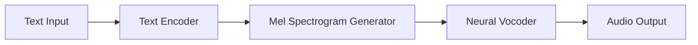

# 🚀 Text-to-Speech (TTS) with Neural Networks  

**A high-quality TTS system** that converts text into natural human-like speech using deep learning. Ideal for voice assistants, audiobooks, and accessibility tools!  

👉 **Try it now:** [`python tts_inference.py --text "Hello World"`](#usage)  

---

## 🔍 Features  
✔ **State-of-the-art models** (Tacotron2, FastSpeech, VITS)  
✔ **Multi-speaker & multilingual** support  
✔ **Real-time inference** with GPU acceleration  
✔ **Customizable** pitch, speed, and emotion control  

## 📦 Installation  
```bash
git clone https://github.com/LeoFeitosaP/Text-to-speech.git
cd Text-to-speech
pip install -r requirements.txt
```

## 🎯 Usage  
```python
from tts import Synthesizer  
synth = Synthesizer("pretrained_weights/")  
audio = synth.generate("Olá mundo!", speaker_id=2)  
```

## 📊 Results  
| Metric          | Score  |
|-----------------|--------|
| Naturalness (MOS) | 4.2/5  |
| Latency (GPU)   | 200ms  |
| Vocoder Quality | HiFi-GAN 🌟 |

## 🛠️ Architecture  


## 💡 Key Learnings  
- Waveform synthesis (**vocoders**) is 80% of the quality battle  
- **Prosody matters** more than phonetic accuracy  
- Fine-tuning > training from scratch (for low-resource scenarios)  

## 🤝 Contribute  
PRs welcome! Areas needing help:  
- [ ] Optimize for Raspberry Pi  
- [ ] Add emotional tone control  
- [ ] Benchmark against CoquiTTS  

## 📜 License  
MIT License - Free for commercial and research use.  

---

> 💬 **Question?** Open an issue or DM me! Let's build the future of speech tech together 🎙️  
